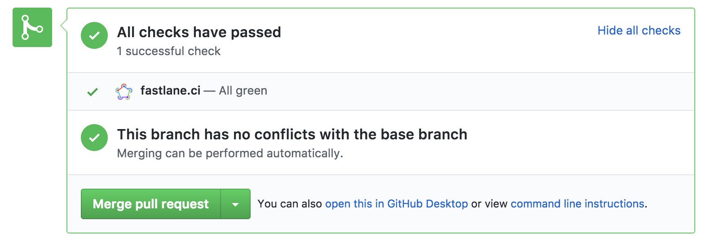

<h3 align="center">
  
</h3>

[](https://github.com/fastlane/ci/blob/master/LICENSE)
[](https://coveralls.io/github/fastlane/ci?branch=master)

# [Alpha 🌋] fastlane.ci

Open source, self-hosted, mobile-optimized CI powered by [fastlane](https://fastlane.tools) brought to you by the _fastlane_ team.

- **Git first**: 100% of your configuration files are stored in git, wherever you want
- **Configuration files first**: Human readable and editable config files, fully transparent
- **Open source**: Just like _fastlane_, `fastlane.ci` is open source and community driven
- **Self hosted**: You should be able to own your CI systems, and scale up as needed
- **Adapters**: Store your configuration and artifacts on services you already use, like GitHub or your own git server
- **Native fastlane integration**: Already use _fastlane_? `fastlane.ci` will work right out of the box for you
- **Mobile first, mobile only**: For now, we're focusing exclusively on building the best CI system for mobile app devs
- **Built in the open**: Together with all of you, MIT licensed
- **Visual interface**: Thanks to `fastlane.ci` you'll be able to benefit from _fastlane_ without having to use the terminal

## Statement

We strongly believe in making Continuous Integration systems for mobile app developers better. While CI is a solved problem for backend and frontend applications, mobile ecosystems saw almost no improvements in their workflows. Three years ago we solved the problem of mobile app deployment with _fastlane_. We want to stay true to our long-term vision of automating every single aspect of your daily development workflow. Together, with the community, we have the experience and know-how to build a world-class, easy-to-use mobile-only CI, with the added benefits of being fully self-hosted and open source.

With this project, we don't just want to make using CI easier, we want to bring [fastlane](https://fastlane.tools) to the next level. While building fastlane.ci, we'll be introducing new features like visually previewing your Fastfile, automatically clearing old TestFlight testers from your account, getting notifications when your app gets approved, and more.

[Interested? Be the first to hear about the official release](https://tinyletter.com/fastlane-tools)



## Project Status

- This project is a work in progress (WIP) and shouldn't be used in production yet
- The idea is to build and iterate with the mobile development community out in the open
- We'd love your help to shape the product, check out [CONTRIBUTING.md](CONTRIBUTING.md) for more info
- Our complete task list is available on our public [GitHub board](https://github.com/fastlane/ci/projects/1)
- We also have our current [milestones listed](https://github.com/fastlane/ci/milestones)
- We started a [poll](https://github.com/fastlane/ci/issues/93) to get a better feeling of how you'd be using `fastlane.ci`, please comment and let us know.

## Docs

- [VISION.md](VISION.md): Describes the overall vision and idea of this project, with its core principals
- [docs/SystemArchitecture.md](docs/SystemArchitecture.md): Describes the overall design architecture of `fastlane.ci`, including the controllers, services, data sources, and data objects
- [docs/ArtifactsAndBuilds.md](docs/ArtifactsAndBuilds.md): Describes how we store builds and their artifacts
- [docs/use_cases](docs/use_cases): Describe the ideal use cases and the user flow
- [docs/EnvironmentVariables.md](docs/EnvironmentVariables.md): Describe the various environment variables that are available

## System Requirements

Requires Ruby 2.3.3 or higher. macOS and Xcode are required when building iOS projects. Refer to the [fastlane documentation](https://docs.fastlane.tools/getting-started/ios/setup/#installing-fastlane) for more information.

## Using `fastlane.ci`

Right now, `fastlane.ci` is in Alpha, we'd love for you to give it a try. Getting up and running isn't as smooth as it will be once we ship a public release, but it shouldn't be too hard:

1. Open the Terminal on the Mac you want to run as `fastlane.ci`
1. `git clone https://github.com/fastlane/ci`
1. `cd ci`
1. `gem install bundler`
1. `bundle install`
1. `bundle exec rake prod`
1. Up and running at [localhost:8080](http://localhost:8080/)

### Using the `fastlane.ci` Angular frontend

Check out [web](./web) for more details on how to set things up. Note that the Angular-based front-end doesn't cover all the features of the traditional web-frontend yet.

## Using `fastlane.ci` with Docker

Currently, Docker deployment is for Linux projects only.

1. [Install Docker](https://docs.docker.com/install/)
1. Open the Terminal on the Mac or on a Linux you want to run as `fastlane.ci`
1. `git clone https://github.com/fastlane/ci`
1. `cd ci`
1. `docker-compose up`
1. Up at running at [localhost:8080](http://localhost:8080/)

## Using `fastlane.ci` with Vagrant
1. Install Vagrant: `brew cask install vagrant`
1. Install VirtualBox: `brew cask install virtualbox`
1. `vagrant up`. You will be asked for your password.
1. `vagrant ssh`
1. `cd /fastlane-ci`
1. `bundle exec rake dev`
1. Up at running at [localhost:8080](http://localhost:8080/)

### Configure `fastlane.ci`

1. Visit [localhost:8080](http://localhost:8080/)
1. Follow the onboarding instructions in your browser. In particular you'll have to create a separate GitHub account that will be used for all bot activities

## Development installation

Run the rake task: `rake dev_bootstrap`.
1. Install all dependencies (ruby, javascript)
2. Add a pre-commit hook

## Local development

```
bundle exec rake dev
```

Visit [localhost:8080](http://localhost:8080/) to open the login

If you're having trouble and need to debug, you can add the following environment variables:
`FASTLANE_CI_VERBOSE=1` and `DEBUG=1`

`FASTLANE_CI_VERBOSE` enables extra logging which includes thread ids, and other non-essential information that could be useful during debugging.


## Run tests

```
bundle exec rspec
```

## Code style

```
bundle exec rubocop -a
```

## License

This project is licensed under the terms of the MIT license. See the [LICENSE](LICENSE) file.

> This project and all fastlane tools are in no way affiliated with Apple Inc.

----

[Interested? Be the first to hear about the official release](https://tinyletter.com/fastlane-tools)
