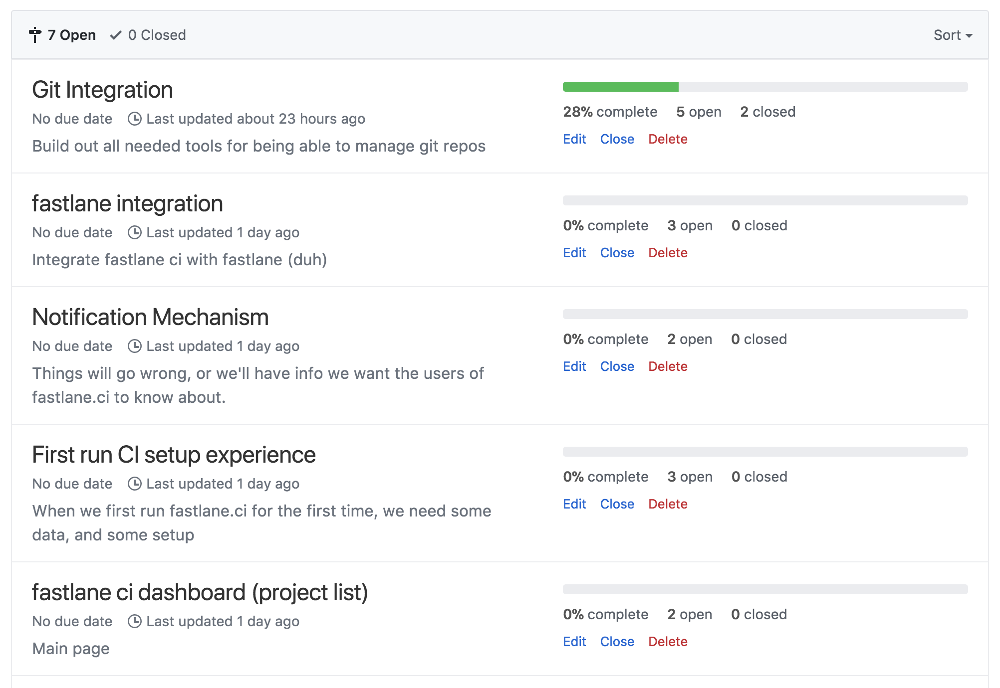

<h3 align="center">
  
</h3>

[](https://twitter.com/KrauseFx)
[](https://twitter.com/taquitos)
[](https://github.com/fastlane/ci/blob/master/LICENSE)

# [WIP] fastlane.ci

Open source, self-hosted, mobile-optimized CI powered by [fastlane](https://fastlane.tools) brought to you by the _fastlane_ team.

- **Git first**: 100% of your configuration files are stored in git, wherever you want
- **Configuration files first**: Human readable and editable config files, fully transparent
- **Open source**: Just like _fastlane_, `fastlane.ci` is open source and community driven
- **Self hosted**: You should be able to own your CI systems, and scale up as needed
- **Adapters**: Store your configuration and artifacts on services you already use, like GitHub or your own git server
- **Native fastlane integration**: Already use _fastlane_? `fastlane.ci` will work right out of the box for you
- **Mobile first, mobile only**: For now, we're focusing exclusively on building the best CI system for mobile app devs
- **Built in the open**: Together with all of you, MIT licensed

## Statement

We strongly believe in making Continuous Integration systems for mobile app developers better. While CI is a solved problem for backend and frontend applications, mobile ecosystems saw almost no improvements in their workflows. Three years ago we solved the problem of mobile app deployment with _fastlane_. We want to stay true to our long-term vision of automating every single aspect of your daily development workflow. Together, with the community, we have the experience and know-how to build a world-class, easy-to-use mobile-only CI, with the added benefits of being fully self-hosted and open source.

With this project, we don't just want to make using CI easier, we want to bring [fastlane](https://fastlane.tools) to the next level. While building fastlane.ci, we'll be introducing new features like visually previewing your Fastfile, automatically clearing old TestFlight testers from your account, getting notifications when your app gets approved, and more.

[Interested? Be the first to hear about the official release](https://tinyletter.com/fastlane-tools)


## Project Status

- This project is a very early work in progress (WIP) and can't be used yet
- The idea is to build and iterate with the mobile development community out in the open
- We'd love your help to shape the product, check out [CONTRIBUTING.md](CONTRIBUTING.md) for more info
- Our complete task list is available on our public [GitHub board](https://github.com/fastlane/ci/projects/1)
- We also have our current [milestones listed](https://github.com/fastlane/ci/milestones)
- We started a [poll](https://github.com/fastlane/ci/issues/93) to get a better feeling of how you'd be using `fastlane.ci`, please comment and let us know.

<a href="https://github.com/fastlane/ci/milestones">
  
</a>

## Docs

- [VISION.md](VISION.md): Describes the overall vision and idea of this project, with its core principials
- [docs/SystemArchitecture.md](docs/SystemArchitecture.md): Describes the overall design architecture of `fastlane.ci`, including the controllers, services, data sources, and data objects
- [docs/ArtifactsAndBuilds.md](docs/ArtifactsAndBuilds.md): Describes how we store builds and their artifacts
- [docs/use_cases](docs/use_cases): Describe the ideal use cases and the user flow

## System Requirements

Requires Ruby 2.3.3 or higher. macOS and Xcode are required when building iOS projects. Refer to the [fastlane documentation](https://docs.fastlane.tools/getting-started/ios/setup/#installing-fastlane) for more information.

## Development installation

**Note:** We have a couple dependencies that aren't standalone gems yet, so we included them as git submodules for now

```
bundle install
git submodule init
git submodule update
```

## Environment variables

We recommend create a local `.keys` file that you can load using `source .keys` before starting the server.

`fastlane.ci` needs a CI-account that is used by `fastlane.ci` to commit and push changes that happen from the CI-side of things (e.g. a new build is triggered by a new commit).

The setup below will be simplified as the project becomes more mature. As for now, we don't have a UI or automatic onboarding yet, so you'll have to set those variables up.

```sh
# Arbitrary key you decide. This will be used for password encryption.
# Do not change after selecting a key value, otherwise there will be decoding issues.
export FASTLANE_CI_ENCRYPTION_KEY="key"

# The email address of your fastlane CI bot account
export FASTLANE_CI_USER="email@bot.com"

# The password of your fastlane CI bot account
export FASTLANE_CI_PASSWORD="password"

# The git URL (https) for the configuration repo
export FASTLANE_CI_REPO_URL="https://github.com/your-name/your-ci-config"

# Needed just for the first startup of fastlane.ci:
# The email address used for the intial clone for the config repo
export FASTLANE_CI_INITIAL_CLONE_EMAIL="email@user.com"

# The API token used for the initial clone for the config repo
export FASTLANE_CI_INITIAL_CLONE_API_TOKEN="token"
```

## Initial configuration

In order to run fastlane.ci for the first time, the `https://github.com/your-name/your-ci-config` needs to be populated with at least two files.

- `users.json`

```json
[
    {
      "id": "ee75eb27-9246-43c1-af5a-a8d33f8a963f",
      "email": "your-name@gmail.com",
      "password_hash": "some password hash that needs to be created. See instructions below.",
      "provider_credentials": [
        {
          "email": "minuscorp@gmail.com",
          "encrypted_api_token": "some GitHub API token that has been encrypted using the FASTLANE_CI_ENCRYPTION_KEY. See instructions below.",
          "provider_name": "GitHub",
          "type": "github",
          "full_name": "Fastlane CI"
        }
      ]
    }
]
```

- `projects.json`

```json
[
  {
    "repo_config": {
      "id": "ad0dadd1-ba5a-4634-949f-0ce62b77e48f",
      "git_url": "https://github.com/your-name/fastlane-ci-demoapp",
      "full_name": "your-name/fastlane-ci-demoapp",
      "description": "Fastlane CI Demo App Repository",
      "name": "Fastlane CI Demo App",
      "provider_type_needed": "github",
      "hidden": false
    },
    "id": "db799377-aaa3-4605-ba43-c91a13c8f83",
    "project_name": "fastlane CI demo app test",
    "lane": "test",
    "enabled": true,
    "job_triggers": [
      {
        "type": "commit",
        "branch": "master"
      },
      {
        "type": "nightly",
        "branch": "master"
      }
    ]
  }
]
```

In order to generate for the first time the `password_hash` and the `encrypted_api_token` there are some additional steps to follow:

- In `string_encrypter_spec.rb`, right after `describe "string encrypter example" do` add:

```ruby
    require "pry"
    binding.pry
```

- Then `DEBUG=1 bundle exec rspec spec/shared/string_encrypter_spec.rb`.

- When the debug stops, you should be able to paste in:

```ruby
new_encrypted_api_token = StringEncrypter.encode("your_github_token")
Base64.encode64(new_encrypted_api_token)
```

- The result of the code will be the encrypted `encrypted_api_token` in the `users.json` file.

- For the `password_hash`, just execute `BCrypt::Password.create("your_password")` and use it in the `users.json` file.

## Local development

```
bundle exec rackup -p 8080 --env development
```

Visit [localhost:8080](http://localhost:8080/) to open the login

If you're having trouble and need to debug, you can add the following environment variables:
`FASTLANE_CI_VERBOSE=1` and `DEBUG=1`

`FASTLANE_CI_VERBOSE` enables extra logging which includes thread ids, and other non-essential information that could be useful during debugging.


## Run tests

```
bundle exec rspec
```

## Code style

```
bundle exec rubocop -a
```

----

[Interested? Be the first to hear about the official release](https://tinyletter.com/fastlane-tools)

## We're hiring!

Are you passionate about _fastlane_ already, and want to help us build `fastlane.ci`? We're looking for engineers to join our team, drop us a message with your CV to fastlane@google.com.
