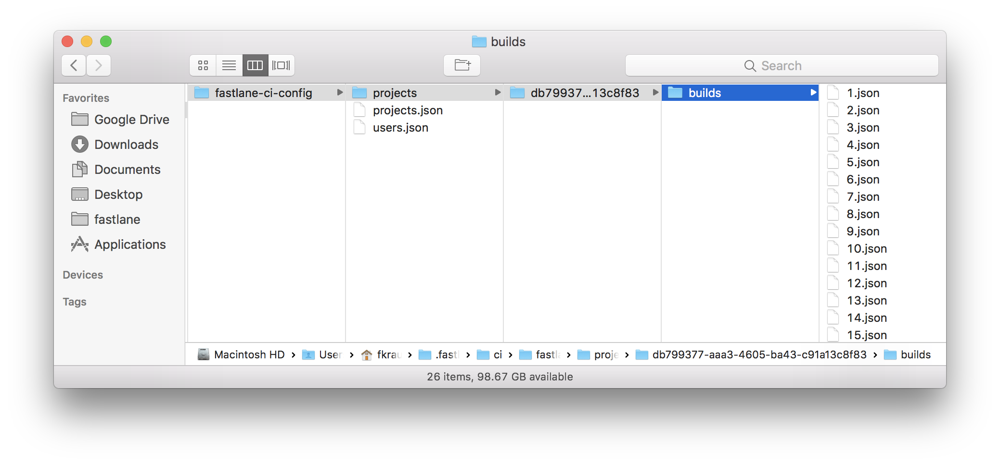

# Artifacts and Builds

## Background

With `fastlane.ci` we wanted to have all of the user's configuration and information in a single location. This allows an easy restore in case of a system failure or data loss. 

It's easy with configuration files, as there are only a few of them, each a few Kilobytes only. Similar to how we handle configuration files with [fastlane](https://fastlane.tools), we just store JSON and Ruby based configuration files as part of a `ci-config` repo.

Storing each build, its output and its artifacts however introduces a challenge: Scaling and repo size. Since most development teams use CI systems to run tests for every single commit, within just a few weeks some teams would end up with tens of thousands of builds, their logs and their artifacts.

Git is not designed to handle such use-case well enough, so we decided to find a better solution, that keeps the ease-of-use, while still handling artifacts separately in a more optimized way.

By storing all of the configuration in git, we give the user full control over how and where their data is stored. We want to have the same be the case for build outputs and artifacts. Those could be confidential and sensitive and every development team should be able to choose for themselves on where to store them.

## Solution

With `fastlane.ci` we're going with a hybrid model, to offer best of both worlds

- The `ci-config` repo includes a JSON file for each build, representing the basic metadata. It should be limited to short amounts of strings (not the full build output).
- Each JSON file then links to additional artifacts. The artifacts are therefore stored separately, and will be downloaded on demand, making the storing and parsing of the JSON files fast and efficient. 

By using this appraoch, all really important build metadata will always persist and won't get lost in case of a system failure. All artifacts are then either stored on the local machine where `fastlane.ci` runs (making it the responsibility of the developer to do backups), or uploaded a cloud hosting service like Google Cloud Storage.

The artifact system is built in a way to allow any developer to integrate `fastlane.ci` into whatever the team is already using. By default, `fastlane.ci` will provide a basic set of integration with a unified interface, allowing the community to extend it to support more and more storage options.



A sample `[build_number].json` might look like this;

```json
{
  "number": 5,
  "status": "success",
  "timestamp": 1516639255,
  "duration": 13.283,
  "sha": "e8c5475201ed3e7e7c76a1b65301be9769718179",
  "artifacts": [
    {
      "type": "iOS/log",
      "url": "https://storage.googleapis.com/fastlane-ci/output.log"
    },
    {
      "type": "iOS/ipa",
      "url": "https://storage.googleapis.com/fastlane-ci/MyApp.ipa"
    },
    {
      "type": "iOS/dSYM",
      "url": "https://storage.googleapis.com/fastlane-ci/MyApp.ipa.dSYM"
    },
    {
      "type": "fastlane/report.xml",
      "path": "fastlane-ci/ouptut/1247435234/report.xml"
    }
  ],
  "context": {
    "fastlane-ci-plugin-test_coverage": {
      "currentCoverage": 0.83
    },
    "fastlane-ci-plugin-post_open_todos": {
      "openTodosFound": [
        "FBFileHelper.m:93",
        "FBFileManager.m:181",
        "AppDelegate.m:13938"
      ]
  	}
  }
}
```

The above JSON file is just an example of how one `[build_number].json` file might look like. A few notes:

- Outside the artifacts link, we store only the necessary information needed to identify a build, and show in on the user interface.
- There can be any number of artifacts, that can be rendered as a link on the `fastlane.ci` web UI
	 - Each artifact has a type, that might be a "parent" defined (e.g. `iOS`, `android`, `react-native`).
	 - Each artifact either has a `url` or a `path` defined, whereas `url` is usually a remote URL, and `path` being a local file path for non-important metadata.
   - By storing the build artifacts externally, the user can easily switch artifact provided (e.g. from AWS S3 to Google Cloud storage), and still keeps their artifacts and with it all links, assuming the user keeps their account running.
- Additionally to the artifacts (which are basically attachments of larger files for builds), we also thought about the concept of a **Build Context**

## Build Context

Similar to the [fastlane lane context](https://docs.fastlane.tools/advanced/#lane-context), we want to offer a flexible way to attach extra information to builds, without having to modify the `fastlane.ci` core. We want to take an approach that offers a solid foundation for future features, like a plugin system. The `context` sample code shows how we can namespace data easily using the plugin's name (or internal `fastlane.ci` module if needed), allowing developers to build powerful tools on top of `fastlane.ci`, like tracking of historic code coverage.

Since we don't have a plugin system yet for `fastlane.ci`, we want to use the Build Context to store the number of open `# TODO` items for this project.
