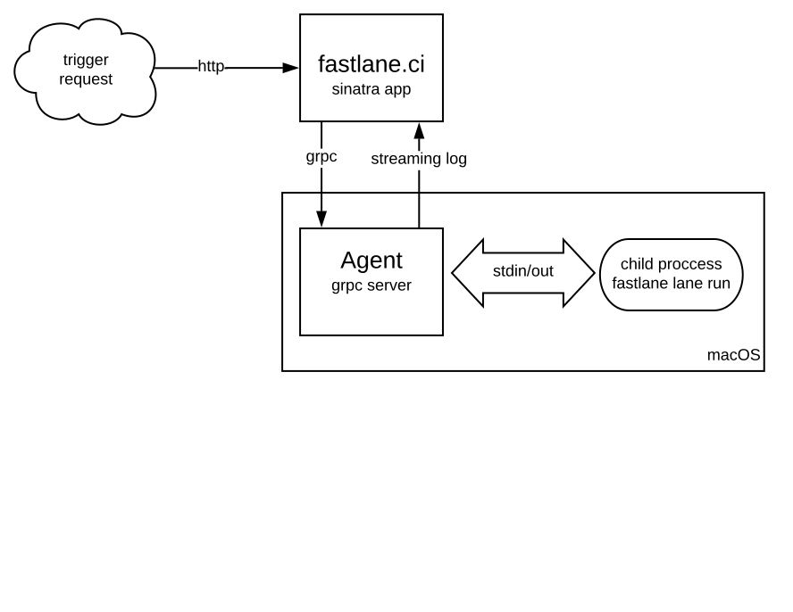

# Worker Agents

## Terminology

* Project - A source repository and a fastlane Lane to perform onto it.
* Worker - A mac machine that is available to perform a fastlane Lane. This may or may not be the same machine running the Server.
* Lane - A group of fastlane actions out of the deployment pipeline defined by the user.
* Agent - The service running on the Worker that accepts requests to run Lanes.
* Server - the fastlane.ci sinatra web app.

## Context
Given a Project, we want to be able to run the Lane in a stable, isolated, idempotent manner. We want the user to be able to view the results in real-time and see progress, as well as store the output as an artifact for later access. Ideally this proposal will satisfy the requirements for single instance and distributed architectures for fastlane.ci.

## Proposal
We create an Agent daemon that is running on each Worker. The Agent can be run by launchd on macOS or systemd on Linux. The Agent should be as small and self-contained as possible with minimum dependencies. It should be very easy to install the Agent on a fresh os install or stock VM image.

The Agent is responsible for the following:
1. Handle GRPC requests to perform work from Server.
2. Spawn a process with the appropriate Lane name, configured with the correct execution user, group, and environment.
3. Connect the output of the command to GRPC response to the Server.
4. Report back the exit status of the child process.
5. Deliver artifacts to any external persistence services.

## Process Environment
Each GRPC request to the Agent should contain all of the necessary configuration information required to run the Lane successfully. This can be accomplished by supplying an environment (the ENV variables) to the child process when it is spawned by the Agent.

For more on using the environment for configuration (https://12factor.net/config)
The Agent may have to fetch resources (such as source code) from other services but it should not have to fetch any configuration data.

## Permission model
The Agent will be required to run arbitrary Ruby code on the Worker. It may also be required to perform operations that require root such as installing Xcode. While there will be other security mechanisms that will enforce strict security against malicious users, we can help ourselves by preventing accidental (or incidental) damage to the Worker by running the Agents under a special user that belongs to the sudoers group. This will allow us to whitelist the commands and permissions the user can perform on a Worker.

## Rejecting a job
An Agent must be able to reject a job from the server. This is needed for a common situation around Xcode
1. Server wants to build a PR
1. Agent gets job assigned, checks out the repo, and finds an updated `.xcode-version` file specifying an Xcode beta release
1. Agent checks if the specific Xcode beta is installed on its machine
    1. If available, use that version to run _fastlane_
    1. If not available, Agent triggers installation of given Xcode beta release
        1. Agent notifies Server that it can't handle this particular build right now
        1. Server puts task back on the task queue and tries to distribute this task again later
        1. While Agent installs new Xcode (which might take multiple hours), Agent is free to run other jobs

## Throttling
Each agent is capable of spawning as many processes to handle the requests as it wants, but there are stability considerations that we should take into account. Lane execution  may be very resource heavy and launching too many of them may make the Worker kill the process prematurely. There are two possibilities for implementing throttling:
1. Implement a serial queue on the Agent
2. The Agent reports its capacity to the Server and rejects requests that cannot be fulfilled.

Given that there will probably be a queueing service in the Server that will be responsible for distributing workload across many workers, it seems like the Agent should not implement another queue. The logic for job queueing should live somewhere higher in the stack and the Agent should simply be able to report its capacity when queried.

## Persistence
Workers should be ephemeral and all artifacts need to be placed somewhere with strong persistence during the execution. Logs should be streamed as part of the GRPC response. After a successful fastlane run, other artifacts such as IPA files and screenshots should be persisted outside of the Worker. Additionally the raw log file should be persisted as well, to access them in the future.
